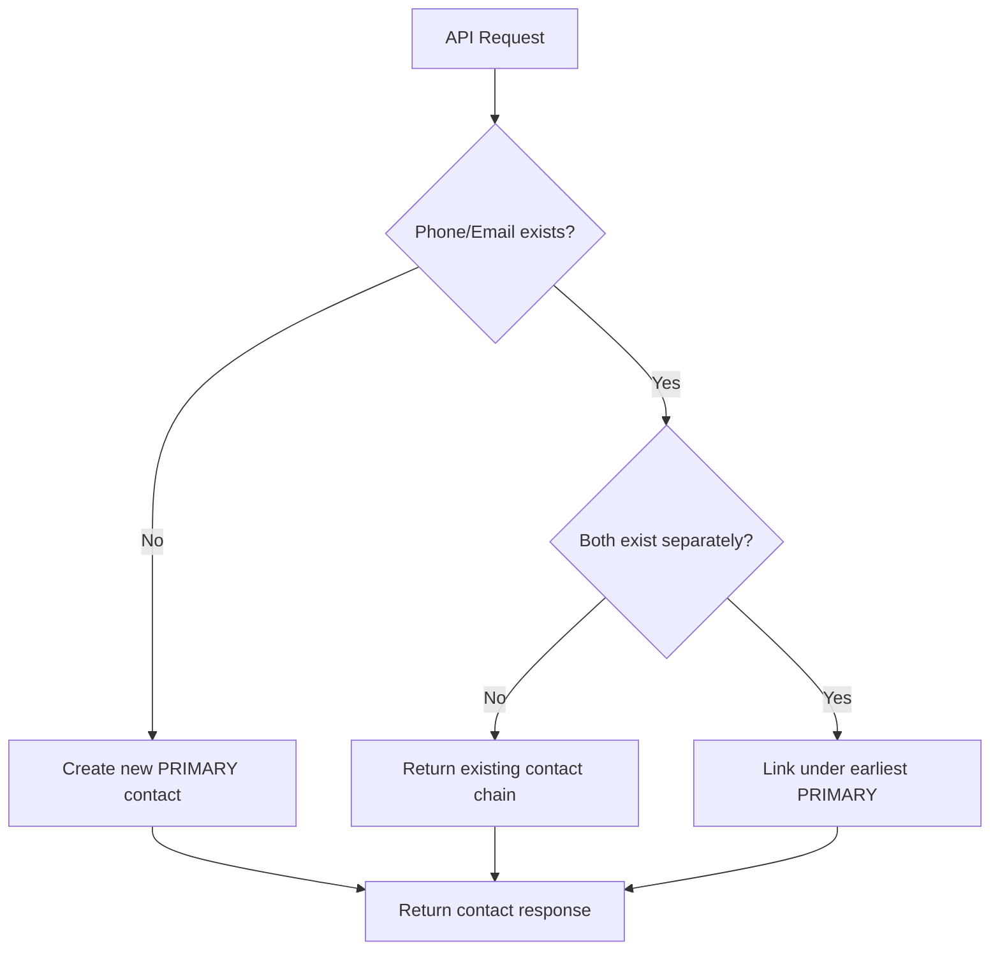

# 📞 Identify Reconciliation – TypeScript + Express + PostgreSQL + Sequelize

[](https://www.typescriptlang.org/)
[](https://nodejs.org/)
[](https://expressjs.com/)
[](https://www.postgresql.org/)
[](https://sequelize.org/)

A modern, type-safe RESTful API that intelligently identifies and manages primary and secondary contact relationships based on phone numbers and emails. Built with **TypeScript**, **Express.js**, **PostgreSQL (NeonDB)**, and **Sequelize** ORM.

---

## ✨ Features

🔍 **Smart Contact Detection** - Identifies existing contacts based on phone or email  
🔗 **Intelligent Linking** - Links contacts using sophisticated `linkPrecedence` strategy  
⚡ **Auto-Creation** - Creates new contact entries when necessary  
🎯 **Complete Retrieval** - Fetches all associated emails and phone numbers together  
🔄 **Idempotent Operations** - Designed for real-world contact management scenarios  
🛡️ **Type Safety** - Full TypeScript support with compile-time error checking  

---

## 🏗️ Tech Stack

| Layer           | Technology                   | Purpose                        |
| --------------- | ---------------------------- | ------------------------------ |
| **Language**    | TypeScript                   | Type-safe development          |
| **Runtime**     | Node.js                      | Server-side JavaScript runtime |
| **Framework**   | Express.js                   | Web application framework      |
| **Database**    | PostgreSQL (Neon.tech)      | Relational database           |
| **ORM**         | Sequelize                    | Database modeling & queries    |
| **Migration**   | Sequelize CLI                | Database schema management     |
| **Environment** | dotenv                       | Environment variable management |
| **Build**       | TypeScript Compiler (tsc)   | Compilation to JavaScript      |

---

## 📂 Project Architecture

```
📁 Bite-Speed-Assignment/
├── 📁 config/
│   └── config.json                     # Sequelize database configuration
├── 📁 dist/                           # Compiled JavaScript output
│   ├── 📁 controllers/
│   ├── 📁 db-config/
│   ├── 📁 db-repository/
│   ├── 📁 models/
│   ├── 📁 route/
│   ├── 📁 services/
│   └── index.js                       # Main compiled entry point
├── 📁 migrations/
│   └── 20250716143933-create-contact-table.js
├── 📁 src/                            # TypeScript source code
│   ├── 📁 controllers/
│   │   └── Intentify-contact.ts       # Request/response handling
│   ├── 📁 db-config/
│   │   └── db-connection.ts           # Database connection setup
│   ├── 📁 db-repository/
│   │   └── db-call-repo.ts            # Database operations layer
│   ├── 📁 models/
│   │   └── contact-model.ts           # Sequelize Contact model
│   ├── 📁 route/
│   │   └── Identify-contact-route.ts  # API route definitions
│   ├── 📁 services/
│   │   └── contact-service.ts         # Business logic layer
│   └── index.ts                       # Main TypeScript entry point
├── 📁 node_modules/                   # Dependencies
├── 📄 .env                            # Environment variables
├── 📄 .gitignore                      # Git ignore rules
├── 📄 package.json                    # Project dependencies & scripts
├── 📄 package-lock.json               # Locked dependency versions
├── 📄 tsconfig.json                   # TypeScript configuration
└── 📄 README.md                       # Project documentation
```

---

## 🧠 Core Logic & Flow

### 🔄 Contact Resolution Algorithm



### 📋 Business Rules

1. **New Contact Creation**:
   - If neither phone nor email exists → Create new contact as `primary`

2. **Existing Contact Handling**:
   - If phone/email exists → Return associated `primary` contact and all linked ones
   - If both phone & email exist in separate chains → Link them under earliest `primary`

3. **Link Precedence Strategy**:
   - `primary` → Main contact entry
   - `secondary` → Linked to a primary (stores `linkedId`)

4. **Idempotent Operations**:
   - Repeated requests with same data maintain data integrity

---

## 🚀 API Reference

### 🎯 Identify Contact Endpoint

```http
POST /api/v1/identify
Content-Type: application/json
```

**Request Body:**
```typescript
interface IdentifyRequest {
  email?: string;
  phoneNumber?: string;
}
```

**Response:**
```typescript
interface IdentifyResponse {
  contact: {
    primaryContactId: number;
    emails: string[];
    phoneNumbers: string[];
    secondaryContactIds: number[];
  }
}
```

### 📝 Example Request/Response

```json
// Request
{
  "email": "john@example.com",
  "phoneNumber": "9999999999"
}

// Response
{
  "contact": {
    "primaryContactId": 1,
    "emails": ["john@example.com", "john.alt@example.com"],
    "phoneNumbers": ["9999999999", "8888888888"],
    "secondaryContactIds": [2, 3]
  }
}
```

---

## 🛠️ Setup & Installation

### 1. 📥 Clone Repository

```bash
git clone https://github.com/mohammadamanpatel/Bite-speed-assignment.git
cd Bite-speed-assignment
```

### 2. 📦 Install Dependencies

```bash
npm install
```

### 3. 🔧 Environment Configuration

Create a `.env` file with the following sample credentials:

```env
# Database Configuration
PGHOST=<your-host>                # e.g., ep-xxxxxx.neon.tech
PGDATABASE=<your-database>        # e.g., neondb
PGUSER=<your-username>            # e.g., neondb_owner
PGPASSWORD=<your-password>        # e.g., your Neon.tech DB password
PGPORT=5432

# Server Configuration
SERVER_PORT=5001
```

> ⚠️ **Important**: Replace these with your actual Neon.tech database credentials

### 4. 🗄️ Database Setup

**Step 1:** Configure your database credentials in `config/config.json`:

```json
{
  "development": {
    "username": "your_neon_username",
    "password": "your_neon_password",
    "database": "your_neon_database",
    "host": "your_neon_host.neon.tech",
    "port": 5432,
    "dialect": "postgres",
    "dialectOptions": {
      "ssl": {
        "require": true,
        "rejectUnauthorized": false
      }
    }
  }
}
```

> 🔥 **Critical**: Please insert your actual Neon.tech credentials in the `config/config.json` file in the config directory to migrate the table successfully.

**Step 2:** Run database migrations:

```bash
npx sequelize-cli db:migrate
```

### 5. 🏗️ Build Project

```bash
npm run build
```

### 6. 🚀 Start Server

**Development Mode:**
```bash
npm run dev
```

**Production Mode:**
```bash
npm start
```

**Server Status:**
```
✅ Server is running fine 😊
🔄 Please use Postman to test the /identify route.
Server running on: http://localhost:5001
```

---

## 🧪 Testing & Validation

### 📮 Postman Configuration

- **Method:** `POST`
- **URL:** `http://localhost:5001/api/v1/identify`
- **Headers:** `Content-Type: application/json`
- **Body:** Raw JSON

### 🌐 Live Production Server

- **Method**: `POST`
- **URL** : `https://identify-contact-task.onrender.com/api/v1/identify`
- **Headers**: `Content-Type`: `application/json`
- **Body**: Raw JSON


🚀 Quick Test: You can test the API immediately using the live endpoint above without any local setup!

### 🎯 Test Cases

#### Test Case 1: New Contact Creation
```json
// Input
{
  "email": "alice@example.com",
  "phoneNumber": "1234567890"
}

// Expected Output
{
  "contact": {
    "primaryContactId": 1,
    "emails": ["alice@example.com"],
    "phoneNumbers": ["1234567890"],
    "secondaryContactIds": []
  }
}
```

#### Test Case 2: Existing Contact Match
```json
// Input
{
  "email": "alice@example.com"
}

// Expected Output
{
  "contact": {
    "primaryContactId": 1,
    "emails": ["alice@example.com"],
    "phoneNumbers": ["1234567890"],
    "secondaryContactIds": []
  }
}
```

#### Test Case 3: Contact Chain Linking
```json
// Input
{
  "email": "alice.work@example.com",
  "phoneNumber": "1234567890"
}

// Expected Output
{
  "contact": {
    "primaryContactId": 1,
    "emails": ["alice@example.com", "alice.work@example.com"],
    "phoneNumbers": ["1234567890"],
    "secondaryContactIds": [2]
  }
}
```

---

## 🗃️ Database Schema

### 📊 Contact Table Structure

| Column         | Type         | Constraints | Description                        |
| -------------- | ------------ | ----------- | ---------------------------------- |
| `id`           | INTEGER      | PRIMARY KEY | Unique contact identifier          |
| `phoneNumber`  | VARCHAR(255) | NULLABLE    | Contact phone number               |
| `email`        | VARCHAR(255) | NULLABLE    | Contact email address              |
| `linkedId`     | INTEGER      | FOREIGN KEY | Reference to primary contact       |
| `linkPrecedence` | ENUM       | NOT NULL    | 'primary' or 'secondary'          |
| `createdAt`    | TIMESTAMP    | NOT NULL    | Record creation timestamp          |
| `updatedAt`    | TIMESTAMP    | NOT NULL    | Record last update timestamp       |
| `deletedAt`    | TIMESTAMP    | NULLABLE    | Soft delete timestamp (optional)   |

### 🔗 Relationships

- **Primary Contact**: `linkPrecedence = 'primary'`, `linkedId = null`
- **Secondary Contact**: `linkPrecedence = 'secondary'`, `linkedId` → Primary Contact ID

---

## 📜 Available Scripts

| Script | Command | Description |
| ------ | ------- | ----------- |
| **Build** | `npm run build` | Compile TypeScript to JavaScript |
| **Start** | `npm start` | Run compiled JavaScript in production |
| **Dev** | `npm run dev` | Run with hot-reload for development |
| **Migrate** | `npx sequelize-cli db:migrate` | Run database migrations |

---

## 🔧 TypeScript Configuration

The project uses a comprehensive TypeScript configuration:

```json
{
  "compilerOptions": {
    "target": "es2020",
    "module": "commonjs",
    "outDir": "./dist",
    "rootDir": "./src",
    "strict": true,
    "esModuleInterop": true,
    "skipLibCheck": true,
    "forceConsistentCasingInFileNames": true
  }
}
```

---

## 🎨 Code Style & Standards

- **Language**: TypeScript with strict type checking
- **Naming Convention**: camelCase for variables and functions
- **File Structure**: Layered architecture (Controller → Service → Repository → Model)
- **Error Handling**: Comprehensive try-catch blocks with proper error responses
- **Code Organization**: Separation of concerns with dedicated folders

---

## 🚀 Performance & Optimization

- **Database Indexing**: Optimized queries on phone and email fields
- **Connection Pooling**: Efficient database connection management
- **Type Safety**: Compile-time error detection reduces runtime issues
- **Modular Architecture**: Clean separation enables easy maintenance and scaling

---

## 🔮 Future Enhancements

- [ ] 🔐 **Authentication & Authorization** - JWT-based security
- [ ] 📊 **Analytics Dashboard** - Contact relationship visualization
- [ ] 🔄 **Real-time Updates** - WebSocket integration
- [ ] 🧪 **Unit Testing** - Jest/Mocha test coverage
- [ ] 📝 **API Documentation** - Swagger/OpenAPI integration
- [ ] 🐳 **Docker Support** - Containerization for deployment
- [ ] 📈 **Rate Limiting** - API usage throttling
- [ ] 🔍 **Logging** - Winston/Morgan request logging
- [ ] 🗑️ **Soft Deletion** - Enhanced data recovery options

---

## 🤝 Contributing

We welcome contributions! Please follow these steps:

1. 🍴 Fork the repository
2. 🌿 Create a feature branch (`git checkout -b feature/amazing-feature`)
3. 💾 Commit your changes (`git commit -m 'Add amazing feature'`)
4. 📤 Push to the branch (`git push origin feature/amazing-feature`)
5. 🔄 Open a Pull Request

### 📋 Contribution Guidelines

- Follow TypeScript best practices
- Maintain existing code style
- Add appropriate type definitions
- Update documentation for new features
- Ensure all tests pass

---

## 👨‍💻 Author

**Mohammad Aman Patel**
- GitHub: [@mohammadamanpatel](https://github.com/mohammadamanpatel)
- Email: ap5277478@gmail.com

---

## 📞 Support

If you encounter any issues or have questions:

1. 🐛 **Bug Reports**: Open an issue on GitHub
2. 💡 **Feature Requests**: Discuss in GitHub Discussions
3. 📧 **Direct Support**: Contact the maintainer

---

## 🥰 Acknowledgments

- **Neon.tech** for providing excellent PostgreSQL hosting
- **Sequelize** team for the robust ORM
- **TypeScript** team for type safety
- **Express.js** community for the reliable framework

---

<div align="center">

**Made with ❤️ and TypeScript**

*Star ⭐ this repository if you found it helpful!*

</div>
